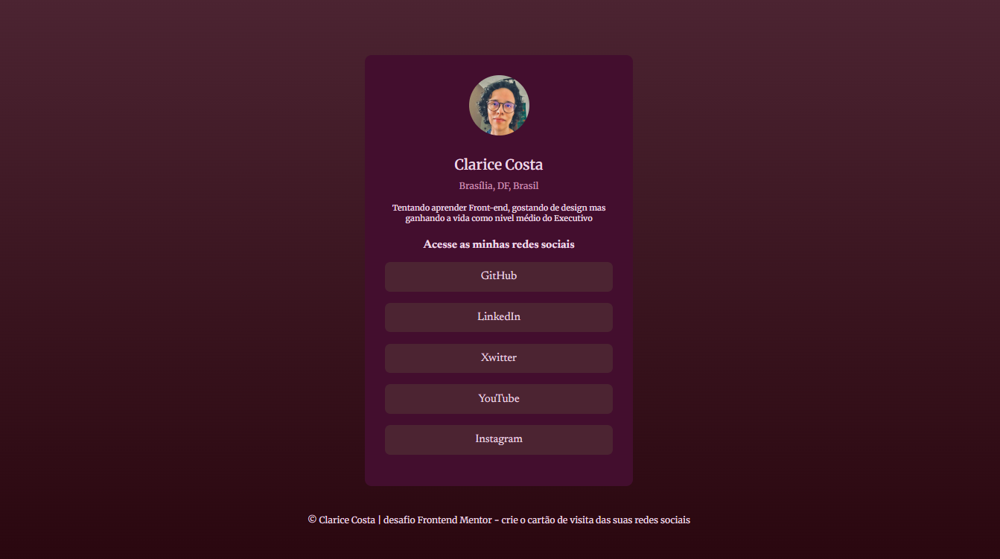

# Frontend Mentor | Social Links Profile

Este é um projeto de **Front-end** desenvolvido como parte de um desafio do **Frontend Mentor**.  
Sua proposta é criar um **cartão de perfil com links para redes sociais**, com foco em HTML semântico, CSS e responsividade.

## 📸 Screenshot

## 🧩 O desafio

O desafio consistiu em construir um cartão de perfil que apresentasse:
- Minha foto
- Nome e localização
- Pequena descrição
- Links para redes sociais

O layout é simples e responsivo.

## 🛠️ Tecnologias utilizadas

- HTML5  
- CSS3  
- Flexbox  
- Media Queries  
- Google Fonts  

## 📱 Responsividade

O layout foi desenvolvido para se adaptar a diferentes tamanhos de tela, com ajustes específicos para dispositivos móveis.

## 📚 O que eu aprendi

Neste projeto, pratiquei:
- Estruturação com HTML semântico  
- Centralização de elementos usando Flexbox  
- Organização de estilos em CSS  
- Criação de layouts responsivos  

## 🚀 Desenvolvimento contínuo

Pretendo continuar melhorando este projeto conforme avanço nos meus estudos em Front-end, aplicando novos conceitos e boas práticas.

## 👩‍💻 Autora

- GitHub: [claricosta](https://github.com/claricosta)
- Frontend Mentor: https://www.frontendmentor.io/profile/claricosta

---

Este projeto foi desenvolvido como parte dos desafios do **Frontend Mentor**, uma plataforma que ajuda desenvolvedores a melhorar suas habilidades através de projetos reais.
